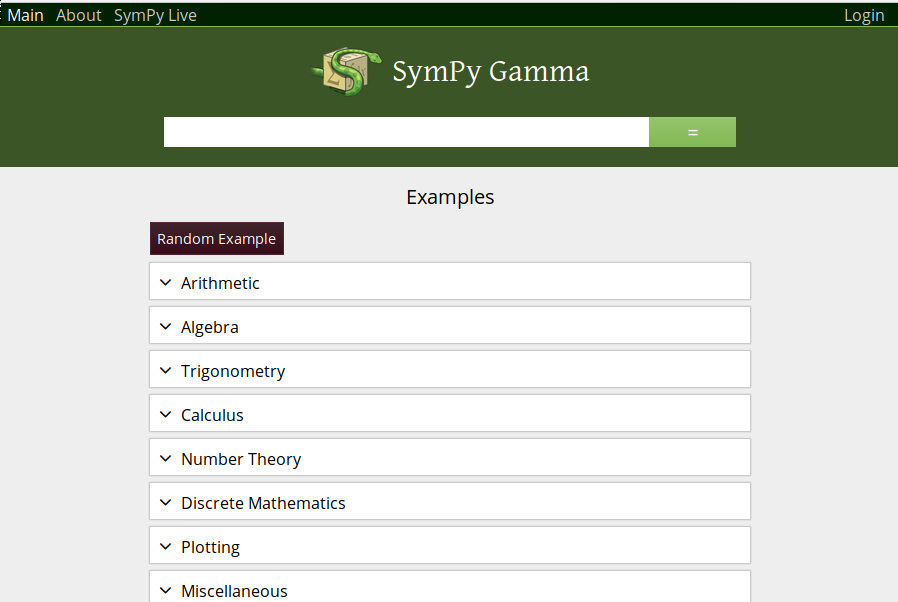
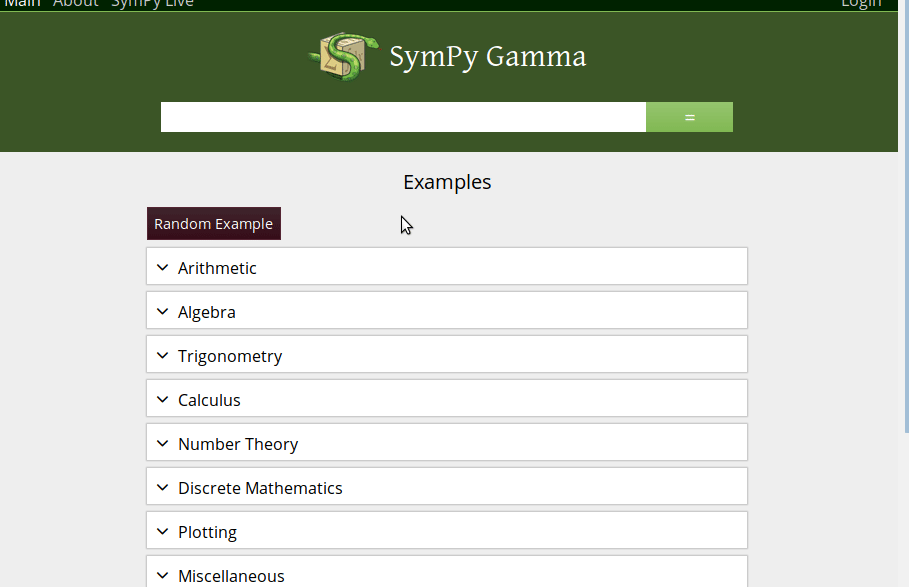
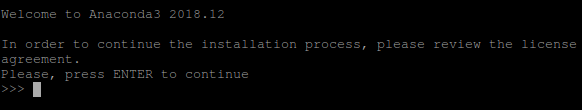
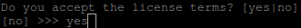

# Instalación y uso

Como **SymPy** es una librería de **Python** que además depende de otras, la instalación manual puede resultar tediosa. Por ello, se recomienda hacerlo mediante un paquete que nos instala todo automáticamente.  Sin embargo, podemos probar como funciona SymPy sin instalar nada:

## La opción más fácil: SymPy-Gamma  

SymPy Gamma es una interfaz web que implementa un intérprete de Python con un paquete de funciones básicas de la librería SymPy. Por tanto, no tendremos acceso a todo el potencial de SymPy aunque la mayoría de las veces será suficiente.  Desde un navegador accedemos a [https://gamma.sympy.org/](https://gamma.sympy.org/)



Si nos fijamos, aparece un barra para introducir la instrucción a ejecutar, junto con un "=" que lo ejecutará.

Los ejemplo vienen agrupados en categorías. Si "desplegamos" cualquier ejemplo, veremos el código SymPy correspondiente. Observa que además son enlaces, si pinchas sobre el enlace te copia automáticamente el código en la barra y la ejecuta. De esta manera podemos ir aprendiendo cómo funciona.

**Ejemplo:** Vamos a resolver una ecuación sencilla. 	

$$ x^2-1=0 $$

En SymPy existe una función llamada *solve()* que me permite resolver ecuaciones. Para facilitar las cosas, *solve* sobreentiende que si no le decimos nada tiene que resolver una ecuación del tipo *expr(x)=0*. Para hacerlo debemos excribir *solve(expr(x))*. En nuestro caso la *exp* será *x**2-1* (para elevar se utiliza la notación **)

``` python
solve(x**2-1)
```



## Instalación en local de SymPy

Si finalmente decidimos instalar SymPy en nuestro ordenador existen varias formas, pero la más recomendada es mediante la distribución [Anaconda](https://www.anaconda.com/download/):


En función del sistema operativo descargará un ejecutable u otro. En cualquier caso, el ejecutable es un script para instalar librerías y programas de Python para Data Science, entre los que se encuentra SymP.

Por ejemplo en GNU-Linux ejecutaremos el instalador:

```
$ sh Anaconda3-2018.12-Linux-x86.sh
```

Al ejecutarlo nos pedirá, en primer lugar, que aceptemos la licencia:



Con la barra espaciadora podremos ir pasando las páginas de la licencia hasta llegar al final que nos pedirá aceptarla. Para ello deberemos escibir yes:



El resto de opciones, se pueden modificar o dejarlas por defecto pulsando ENTER.

## Ya tenemos instalado SymPy, ¿cómo sigo?

Desde cualquier programa de Python o entorno de Python.