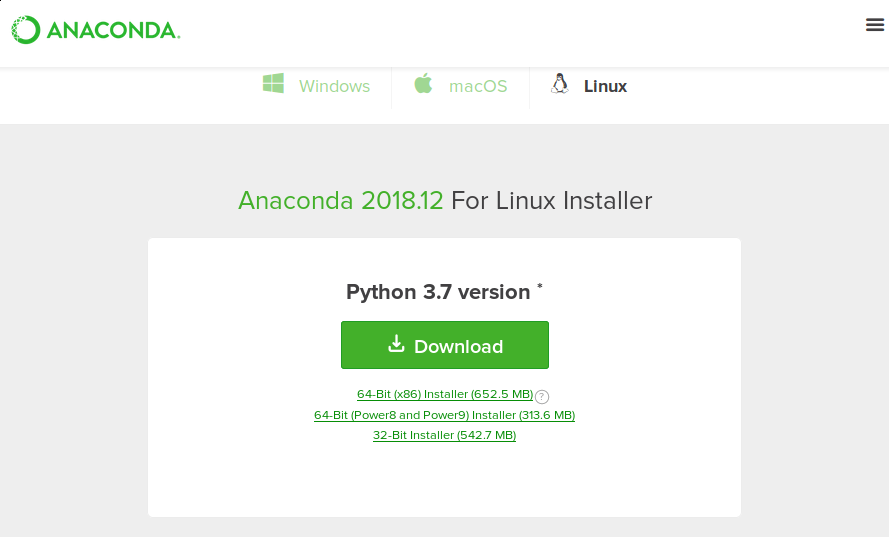

## Probando SymPy sin instalar nada: SymPy 

SymPy Gamma es una interfaz web que implementa 

## Instalación en local de SymPy

Existen varias formas, pero la más recomendada es mediante la distribución [Anaconda](https://www.anaconda.com/download/):



En función del sistema operativo descargará un ejecutable u otro. En cualquier caso, el ejecutable es un script para instalar librerías y programas de Python para Data Science, entre los que se encuentra SymP.

Por ejemplo en GNU-Linux ejecutaremos el instalador:

```
$ sh Anaconda3-2018.12-Linux-x86.sh
```